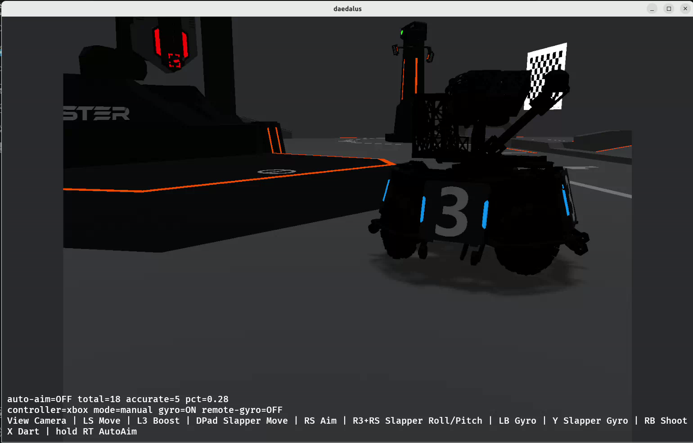
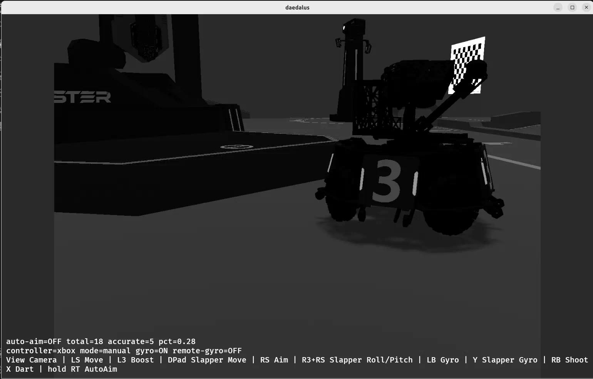
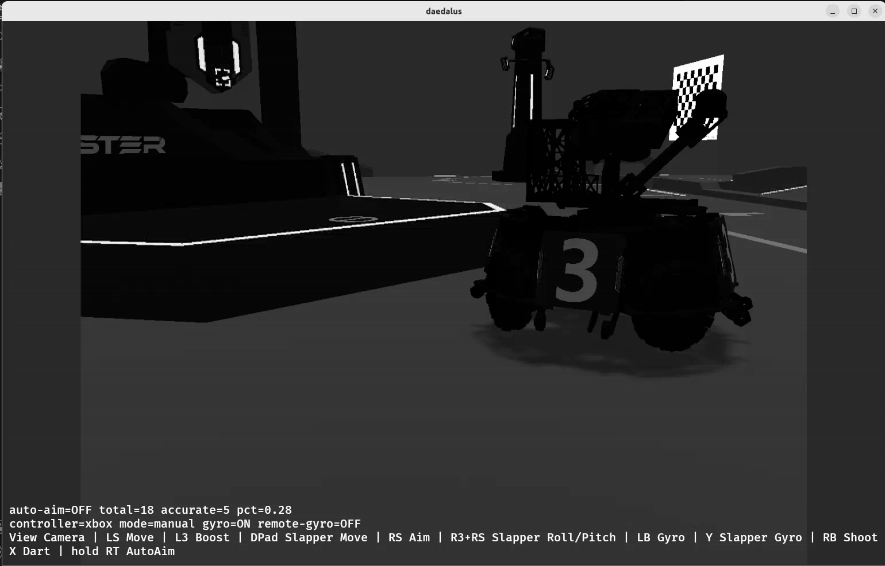
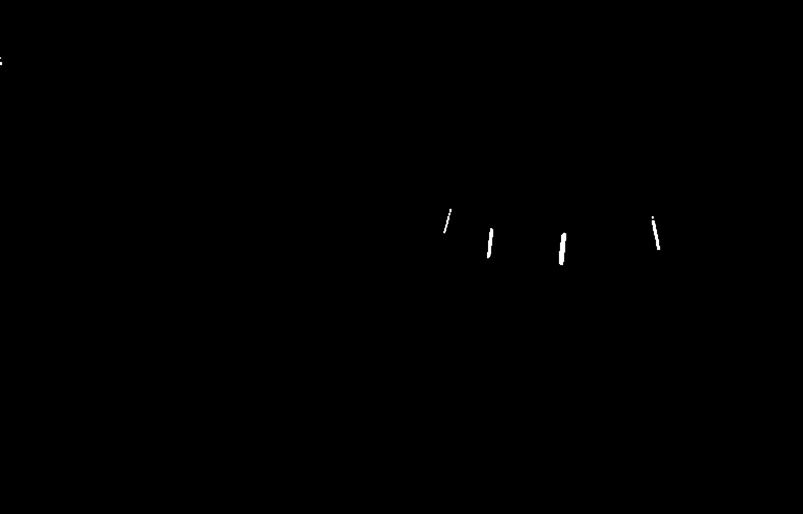
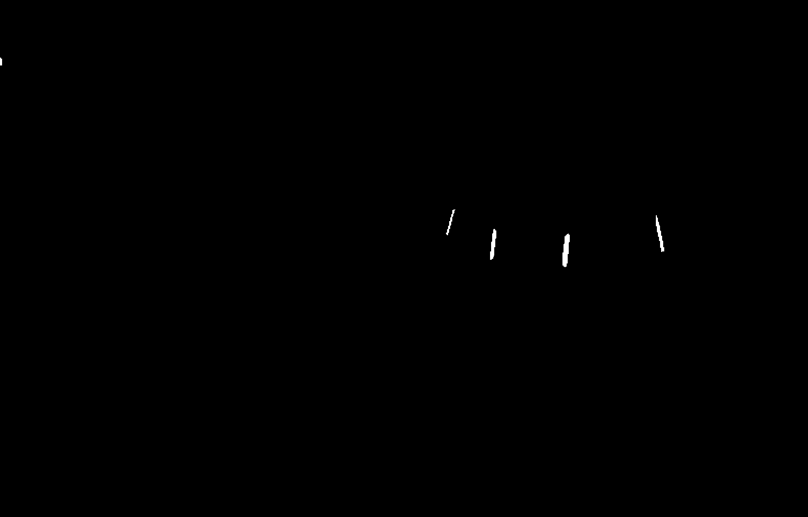
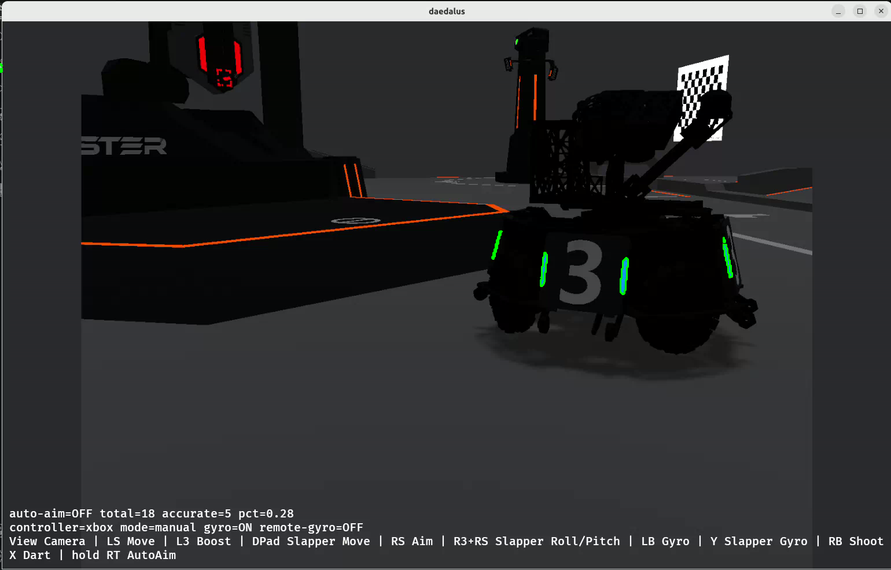
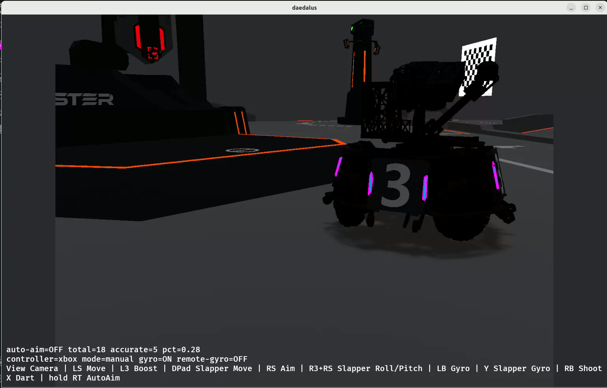
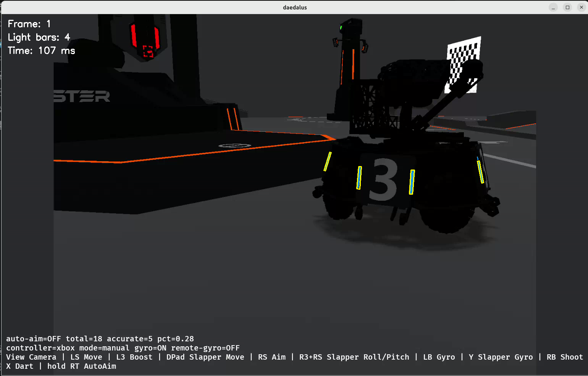

# Task 1：蓝色灯条检测

## 1. 任务目标

从给定视频中逐帧找出机器人装甲板上的蓝色灯条，尽量排除场地中的橙色、红色灯条和其他干扰。每根灯条单独用旋转矩形框出，并把帧号、灯条数和处理时间写到输出视频上。

## 2. 环境与运行方式

- Ubuntu 26.04（WSL2）
- VS Code Remote - WSL
- C++17
- OpenCV 4.10.0

输入视频：

```text
data/test_video2.webm
```

在 `task1` 文件夹中运行：

```bash
g++ -std=c++17 src/main.cpp -o task1 $(pkg-config --cflags --libs opencv4)
./task1
```

也可以在 VS Code 中按 `Ctrl + Shift + B` 编译并运行。

## 3. 处理流程

```text
读取视频帧
→ BGR 通道拆分
→ 蓝通道减红通道并二值化
→ 形态学处理
→ 轮廓提取
→ 多边形近似
→ 最小旋转矩形与几何筛选
→ 写入标记视频
```

## 4. 通道、灰度图与颜色分割

OpenCV 读取到的彩色图像通道顺序是 BGR，不是 RGB。

原始画面：



蓝色通道：


绿色通道：



红色通道：



灰度图：


蓝色灯条在蓝色通道中更亮，而红色和橙色场地灯条在红色通道中更亮，由于该帧绿色极少，所以和灰度图差别不太明显。因此我使用蓝色通道减红色通道：

```cpp
cv::subtract(bgrChannels[0], bgrChannels[2], blueMinusRed);
```

之后以 60 为阈值二值化。`B - R` 大于 60 的像素保留为白色，其余变为黑色。

```cpp
cv::threshold(blueMinusRed, blueMask, 60, 255, cv::THRESH_BINARY);
```

得到的原始蓝色掩膜：


这种方法没有依赖机器人在画面中的固定位置，只根据像素颜色判断，因此机器人移动或画面视角变化时仍能继续检测。

## 5. 形态学处理对比

我比较了三种处理结果：

- 3×3 闭运算：修补灯条中的小孔洞或小间隙；
- 3×3 开运算：尝试去除孤立白色噪点；
- 5×5 闭运算：比 3×3 的修补范围更大。

3×3 闭运算：


3×3 开运算：



5×5 闭运算：



在当前视频的示例帧中，原始掩膜本身比较干净，三种结果没有出现明显差别。5×5 闭运算也没有明显损伤灯条，但核更大时更可能把靠近的白色区域连在一起。因此后续轮廓提取使用更保守的 3×3 闭运算结果。

## 6. 轮廓、多边形和旋转矩形

程序在 3×3 闭运算结果上提取外轮廓：

```cpp
cv::findContours(
    contourInput,
    contours,
    cv::RETR_EXTERNAL,
    cv::CHAIN_APPROX_SIMPLE
);
```

轮廓结果：



然后使用 `approxPolyDP` 简化轮廓。近似允许误差设置为该轮廓周长的 2%，目的是去掉边缘上过于密集的点，同时保留灯条的大致形状。



最后使用 `minAreaRect` 得到可以倾斜的最小外接矩形。相比普通水平矩形，它能更贴合机器人上坡或转动时倾斜的灯条。

## 7. 几何筛选

每条候选轮廓都会计算最小旋转矩形的面积和长宽比：

```cpp
float area = width * height;
float ratio = longSide / shortSide;
```

当前使用的筛选条件为：

```cpp
if (area < 30 || ratio < 1.5) {
    continue;
}
```

面积过小的候选通常是噪点；长宽比过小的候选更像方块，不符合灯条细长的形状，所以采用这种方式对灯条进行筛选，通过筛选后的结果如下：



## 8. 视频输出与异常情况

程序使用 `while (capture.read(frame))` 逐帧处理视频，读到视频末尾后循环自然结束。

- 视频无法打开时，程序输出错误信息并退出；
- 某一帧没有有效灯条时，仍会正常写入该帧，灯条数量显示为 0；
- 输出视频创建失败时，程序输出错误信息并退出。

本视频共处理 634 帧。原视频时长约为 44 秒，一开始尝试在代码读入原视频帧率，但是结果得到的视频仅在1秒左右播放完毕，因此手动设定输出视频使用约 14.4 FPS 保存，以保证播放时长与原视频接近。

结果视频：

[打开结果视频](../output/task1_result.mp4)

视频每一帧都标注了：

- `Frame`：当前帧号；
- `Light bars`：当前帧通过几何筛选的灯条数量；
- `Time`：该帧处理耗时，单位为毫秒。

## 9. 目前的不足

当前阈值 60、最小面积 30 和最小长宽比 1.5 是根据给定视频观察后选取的。对于明显不同的光照、相机曝光或灯条颜色，可能需要重新调整。

