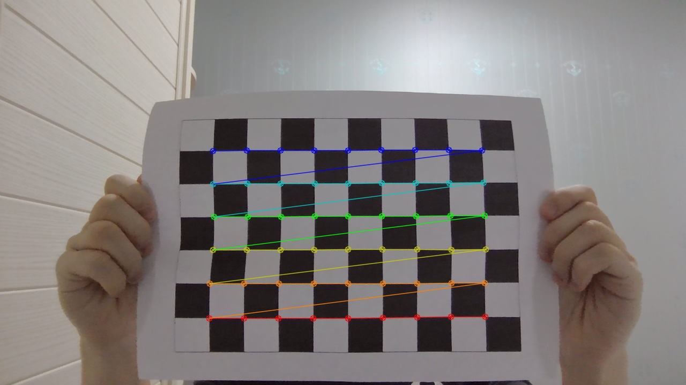
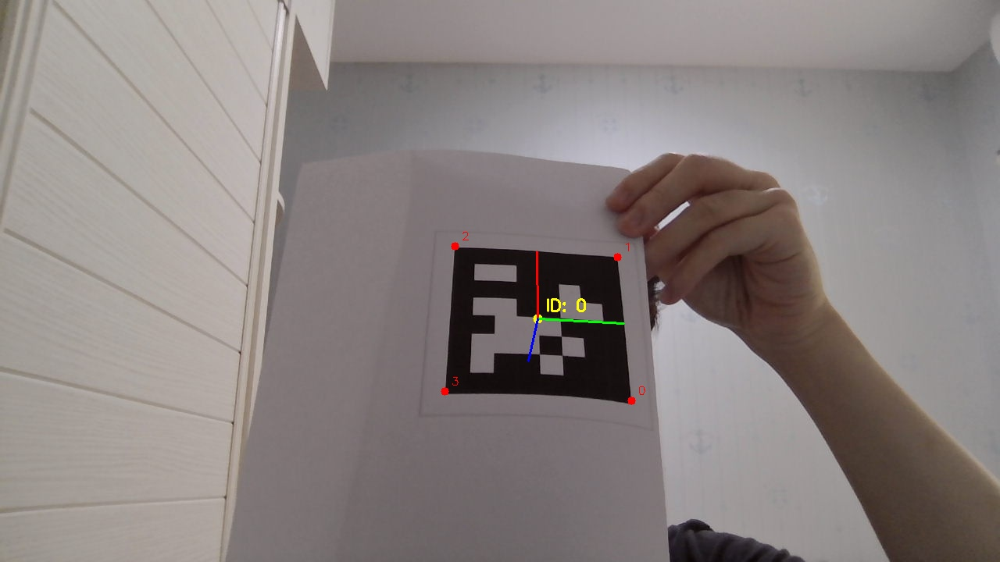

# Task 2：相机标定与 AprilTag 位姿估计

## 1. 任务目标

本任务分为两部分。

第一部分是使用棋盘格对摄像头进行标定，得到相机内参矩阵和畸变系数。相机拍到的二维像素坐标需要结合这些参数，才能对应到较准确的空间位置。

第二部分是识别 AprilTag，输出标签的 ID、中心点、四个角点，以及标签相对摄像头的位置和朝向，并将三维坐标轴画在图像上。

## 2. 环境与运行方式

- Ubuntu 26.04（WSL2）
- VS Code Remote - WSL
- C++17
- OpenCV 4.10.0
- AprilTag 3

任务二中的源文件：

```text
task2/src/capture_calibration.cpp   采集棋盘格图片
task2/src/calibrate_camera.cpp      相机标定
task2/src/apriltag_pose.cpp         AprilTag 检测与位姿估计
```

在 VS Code 中设置了快捷键方便单人测试和任务的时候能拍摄照片：

- `F8`：拍摄一张棋盘格标定照片；
- `F7`：运行相机标定；
- `F6`：运行 AprilTag 检测与位姿估计。

相机需要先通过 usbipd 连接到 WSL，程序使用的设备为：

```text
/dev/video0
```

一开始测试的时候拍摄的照片出现了四分之三画面为绿色的情况，为了避免摄像头在 WSL 中出现绿色画面，程序明确设置了 V4L2、MJPG 格式、1280×720 分辨率和 15 FPS：

```cpp
cv::VideoCapture camera("/dev/video0", cv::CAP_V4L2);

camera.set(
    cv::CAP_PROP_FOURCC,
    cv::VideoWriter::fourcc('M', 'J', 'P', 'G')
);

camera.set(cv::CAP_PROP_FRAME_WIDTH, 1280);
camera.set(cv::CAP_PROP_FRAME_HEIGHT, 720);
camera.set(cv::CAP_PROP_FPS, 15);
```

## 3. 棋盘格参数与图片采集

使用的棋盘格有 10 列、7 行黑白方格，因此内部角点数量为 9×6。

```text
棋盘格内部角点：9 × 6
单个方格实际边长：24 mm = 0.024 m
采集分辨率：1280 × 720
```

采集时尽量让棋盘格出现在画面的不同位置，并改变距离、旋转角度和倾斜角度。这样可以让标定程序看到更多不同的棋盘格姿态，而不是只根据一类画面计算参数。

共拍摄 20 张棋盘格图片，保存在：

```text
task2/data/calibration_images/
```

其中 `calibration_013.jpg` 中棋盘格较小，程序没有找到完整的 9×6 内角点，因此没有参与标定。其余 19 张图片成功识别到 54 个角点。

角点检测结果保存在：

```text
task2/output/corners/
```

示例：



## 4. 相机标定过程

程序先逐张读取棋盘格图片，并使用 `findChessboardCorners` 寻找 9×6 个内部角点：

```cpp
bool found = cv::findChessboardCorners(
    image,
    boardSize,
    corners,
    cv::CALIB_CB_ADAPTIVE_THRESH |
    cv::CALIB_CB_NORMALIZE_IMAGE
);
```

找到角点后，再使用 `cornerSubPix` 对角点位置进行亚像素优化。这样角点不只停留在整数像素位置，能减少标定误差。

对于每一张成功图片，程序保存两组对应关系：

- 图像点：棋盘格角点在图片中的二维像素坐标；
- 物体点：角点在真实棋盘平面中的三维坐标。

棋盘格放在 Z=0 的平面上，因此第 `row` 行、第 `col` 列角点对应的真实坐标为：

```cpp
(col * squareSize, row * squareSize, 0)
```

其中 `squareSize` 为 0.024 m。

最后调用 OpenCV 的 `calibrateCamera`，利用多张图片中的二维、三维对应关系求出相机内参和畸变系数：

```cpp
double reprojectionError = cv::calibrateCamera(
    objectPoints,
    imagePoints,
    imageSize,
    cameraMatrix,
    distortionCoefficients,
    rotationVectors,
    translationVectors
);
```

## 5. 相机标定结果

本次共有 19 张图片成功参与标定，平均重投影误差为：

```text
1.67574 像素
```

重投影误差可以理解为：使用计算出的相机参数把棋盘格三维点投影回图片后，与实际检测角点之间的平均差距。误差越小，说明标定参数越能解释采集到的图片。

本次得到的相机内参矩阵为：

```text
[840.1014545973902, 0, 632.8636433675415;
 0, 832.789866095611, 362.7697962950655;
 0, 0, 1]
```

其中：

- `fx = 840.101...`：横向焦距参数；
- `fy = 832.789...`：纵向焦距参数；
- `cx = 632.864...`、`cy = 362.770...`：主点在图像中的像素位置。

畸变系数为：

```text
[0.07865828076349297, -0.3156511132443518,
 -0.005008388382969709, -0.01081571000213548,
 -0.008477530215537125]
```

标定结果已保存到：

```text
task2/output/camera_calibration.yml
```

后续 AprilTag 位姿估计会读取这个文件，而不是把相机参数直接写死在程序中。

## 6. AprilTag 检测

使用的标签族为 `tag36h11`，打印的标签 ID 为 0。测量黑色外边框的实际边长为：

```text
76 mm = 0.076 m
```

程序读取一帧摄像头图像后，先将 BGR 彩色图转换为灰度图：

```cpp
cv::Mat gray;
cv::cvtColor(frame, gray, cv::COLOR_BGR2GRAY);
```

AprilTag 本身是黑白编码，只需要亮度信息，不需要彩色信息。之后将灰度图包装为 AprilTag 库使用的 `image_u8_t` 格式，再调用检测器：

```cpp
zarray_t* detections = apriltag_detector_detect(
    detector,
    &grayImage
);
```

对每一个检测结果，程序输出：

- AprilTag 的 ID；
- 标签中心点的像素坐标；
- 四个角点的像素坐标。

一次测试中，程序检测到 1 个 AprilTag，ID 为 0，部分输出如下：

```text
中心像素坐标：(541.584, 315.555)
角点 0：(437.028, 205.743)
角点 1：(426.649, 417.214)
角点 2：(644.652, 423.804)
角点 3：(649.848, 219.797)
```

## 7. AprilTag 位姿估计

检测到标签的四个角点后，程序读取 `camera_calibration.yml` 中保存的内参矩阵，并将标签实际边长、焦距和主点位置交给 `estimate_tag_pose`：

```cpp
apriltag_detection_info_t info;

info.det = detection;
info.tagsize = tagSize;
info.fx = cameraMatrix.at<double>(0, 0);
info.fy = cameraMatrix.at<double>(1, 1);
info.cx = cameraMatrix.at<double>(0, 2);
info.cy = cameraMatrix.at<double>(1, 2);

apriltag_pose_t pose;
double poseError = estimate_tag_pose(&info, &pose);
```

程序得到两类姿态结果：

- 旋转矩阵 `R`：表示 AprilTag 相对摄像头的朝向；
- 位移 `t = (x, y, z)`：表示 AprilTag 相对摄像头的位置，单位为米。

一次测试结果如下：

```text
位移 t（米）：(-0.0325174, -0.0171017, 0.29917)
距离：0.301417 米
姿态解算误差：3.04527e-07
```

这里的坐标系以摄像头光学中心为原点：

- X 轴：图像向右；
- Y 轴：图像向下；
- Z 轴：从摄像头向前；
- 单位：米。

因此这次测试中，AprilTag 主要位于摄像头前方约 0.30 m，且略偏向左上方。

姿态解算误差较小，说明根据标签四个角点、实际边长和相机参数计算出的姿态，与当前图像的匹配情况较好。

## 8. 图像可视化结果

程序除了在终端输出数据外，还将结果画回原始图像：

- 黄色圆点：AprilTag 中心点；
- 黄色文字：检测到的 ID；
- 红色圆点与编号：四个角点；
- 红、绿、蓝三条线：X、Y、Z 三维坐标轴。

绘制坐标轴时，先将 AprilTag 库得到的旋转矩阵转换为 OpenCV 使用的旋转向量：

```cpp
cv::Mat rvec;
cv::Rodrigues(rotationMatrix, rvec);

cv::Mat tvec = (cv::Mat_<double>(3, 1) << x, y, z);

cv::drawFrameAxes(
    result,
    cameraMatrix,
    distortionCoefficients,
    rvec,
    tvec,
    tagSize * 0.5,
    2
);
```

最终结果图片：



一共拍摄了两次图片，最终结果图片选择了有倾斜的一张，另一张则正对摄像头，发现当标签几乎正对摄像头时，Z 轴接近镜头方向，在二维图片上的投影可能很短；让标签适当倾斜后，三根坐标轴会更容易观察。

## 9. 目前的不足

本次标定中有 1 张图片没有识别到完整棋盘格角点，因此没有参与计算。平均重投影误差为 1.67574 像素，结果可以用于本任务的 AprilTag 位姿估计，但仍有改进空间。

棋盘格打印在普通纸上，拍摄时纸张存在轻微弯曲，部分图片的角度变化也不够大，这些都会增加标定误差。后续如果需要更高精度，可以将棋盘格贴在硬质平板上，并增加更多不同距离、位置和倾斜角度的有效图片。
